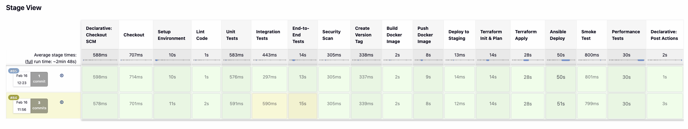

# DevOps CI/CD Exercise

> A full end-to-end CI/CD pipeline built with Jenkins, Docker, Terraform, and Ansible — deploying a Flask application to AWS EC2.

---

## 📐 Architecture Overview




### High-Level Flow

```
Developer → GitHub → Jenkins CI → Docker Hub → Terraform + Ansible → AWS EC2
    │          │          │              │               │               │
  Push      Webhook    Build &        Push           Provision       Deploy &
  Code      Trigger    Test           Image          Infra           Run App
```

---

## 🏗️ Project Structure

```
.
├── app/                          # Flask Application
│   ├── __init__.py               #   App factory (create_app)
│   ├── routes/
│   │   ├── user_routes.py        #   /api/users endpoints (in-memory CRUD)
│   │   └── product_routes.py     #   /api/products endpoints (in-memory CRUD)
│   └── templates/
│       └── index.html            #   Web UI
│
├── tests/                        # Test Suite
│   ├── unit/                     #   Unit tests (routes, utils)
│   ├── integration/              #   API integration tests
│   ├── e2e/                      #   End-to-end (Selenium + headless Firefox)
│   └── performance/              #   Load tests (Locust)
│
├── jenkins/
│   └── Jenkinsfile               # Pipeline definition (11 stages)
│
├── docker/
│   ├── Dockerfile                # Application container
│   ├── Dockerfile.jenkins        # Custom Jenkins image with DevOps tools
│   ├── plugins.txt               # Jenkins plugins list
│   └── casc/
│       └── jenkins.yaml          # Jenkins Configuration as Code
│
├── infrastructure/
│   ├── terraform/                # Infrastructure as Code
│   │   ├── main.tf               #   AWS provider config
│   │   ├── variables.tf          #   Input variables (VPC reuse, EIP toggle, etc.)
│   │   ├── network.tf            #   Conditional VPC, Subnet, IGW, Route Table, SG
│   │   ├── ec2.tf                #   EC2 instance + optional EIP
│   │   ├── outputs.tf            #   IP, DNS, URLs, vpc_reused flag
│   │   └── terraform.tfvars.example
│   └── ansible/
│       ├── deploy.yml            #   Deployment playbook
│       ├── ansible.cfg           #   Ansible configuration
│       └── inventory.ini         #   Dynamic inventory (generated by Jenkins)
│
├── scripts/
│   ├── destroy-staging.sh        # Tear down staging instances via AWS CLI
│   └── start-jenkins-locally.sh  # Local Jenkins startup helper
│
├── main.py                       # App entrypoint
├── calc.py                       # Calculator module
├── requirements.txt              # Python dependencies
└── pytest.ini                    # Pytest configuration
```

---

## 🔧 Tech Stack

| Layer | Technology | Purpose |
|-------|-----------|---------|
| **Application** | Python 3, Flask 2.3 | REST API + Web UI |
| **WSGI Server** | Gunicorn | Production-grade HTTP server |
| **CI/CD Engine** | Jenkins 2.x (LTS) | Pipeline orchestration |
| **Containerization** | Docker, Docker Buildx | App packaging (linux/amd64) |
| **Registry** | Docker Hub | Image storage & distribution |
| **Infrastructure** | Terraform ≥ 1.5 | AWS resource provisioning (conditional) |
| **Configuration Mgmt** | Ansible | Application deployment to EC2 |
| **Cloud** | AWS (us-east-2) | EC2, VPC, Subnet, IGW, SG |
| **Testing** | pytest, Selenium, Locust | Unit / Integration / E2E / Performance |
| **Security** | Bandit | Static security analysis |
| **Linting** | Flake8, Pylint | Code quality |
| **Notifications** | Email (SMTP), Jira REST API | Build alerts & ticket creation |
| **Version Control** | Git, GitHub | Source code management |

---

## 🚀 CI/CD Pipeline

### Pipeline Stages

```
┌─────────────┐
│  1. Checkout │  Clone repo from GitHub
└──────┬──────┘
       ▼
┌─────────────┐
│  2. Setup    │  Create Python venv, install dependencies
│     Env      │
└──────┬──────┘
       ▼
┌─────────────┐
│  3. Lint     │  Flake8 + Pylint static analysis
│     Code     │  → HTML reports published to Jenkins sidebar
└──────┬──────┘
       ▼
┌─────────────┐
│  4. Unit     │  pytest + coverage (HTML, XML, terminal)
│     Tests    │  → Coverage report published to Jenkins sidebar
└──────┬──────┘
       ▼
┌──────────────────┐
│  5. Integration  │  API endpoint testing with Flask test client
│     Tests        │
└──────┬───────────┘
       ▼
┌─────────────┐
│  6. E2E      │  Selenium headless Firefox browser tests
│     Tests    │
└──────┬──────┘
       ▼
┌───────────────┐
│  7. Security  │  Bandit static security analysis
│     Scan      │  → Report published to Jenkins sidebar
└──────┬────────┘
       ▼
┌──────────────────┐
│  8. Create       │  CalVer tag: vYYYY.MM.DD.HHMMSS
│     Version Tag  │  (main/develop branches only)
└──────┬───────────┘
       ▼
┌──────────────────┐
│  9. Build Docker │  docker buildx --platform linux/amd64
│     Image        │  (main/develop branches only)
└──────┬───────────┘
       ▼
┌──────────────────┐
│ 10. Push Docker  │  Push to Docker Hub (ronsss/devops-testing-app)
│     Image        │  (main/develop branches only)
└──────┬───────────┘
       ▼
┌──────────────────────────────────────┐
│  11. Deploy to Staging               │
│  (main/develop branches only)        │
│  ┌────────────────────────────────┐  │
│  │ Terraform Init & Plan          │  │
│  │ Terraform Apply                │  │
│  │ Ansible Deploy                 │  │
│  │ Smoke Test (health + homepage) │  │
│  │ Performance Tests (Locust)     │  │
│  └────────────────────────────────┘  │
└──────────────────────────────────────┘
```

### Jenkins Sidebar Reports

The following HTML reports are published and accessible from the Jenkins build sidebar:

| Report | Content |
|--------|---------|
| **Coverage Report** | pytest-cov HTML coverage (htmlcov/) |
| **Flake8 Report** | Flake8 style warnings |
| **Pylint Report** | Pylint code quality |
| **Performance Report** | Locust load test results |
| **Security Report (Bandit)** | Bandit static security scan |

### Branch-Based Behavior

| Branch | Tests | Docker Build & Push | Deploy to Staging | Performance Tests |
|--------|-------|---------------------|-------------------|-------------------|
| `main` | ✅ All | ✅ | ✅ | ✅ (on deployed EC2) |
| `develop` | ✅ All | ✅ | ✅ | ✅ (on deployed EC2) |
| Feature branches | ✅ All | ❌ Skip | ❌ Skip | ❌ Skip |

### Post-Build Actions

| Condition | Email | Jira Ticket | Priority |
|-----------|-------|-------------|----------|
| **Success** | ✅ Build summary | ❌ | — |
| **Unstable** (test failures) | ✅ With failure details | ✅ Task in KAN project | Medium |
| **Failure** (pipeline error) | ✅ With failed stage | ✅ Task in KAN project | High |

---

## ☁️ AWS Infrastructure

### Conditional Resource Creation

Terraform **reuses existing resources** when they match by name/tag, and only creates what's missing. This prevents conflicts on re-runs:

| Resource | Lookup Method | Created If Missing |
|----------|---------------|-------------------|
| VPC | Tag `Name = staging-vpc` | ✅ |
| Subnet | Tag `Name = staging-public-subnet` in VPC | ✅ |
| Internet Gateway | Attached to VPC | ✅ |
| Route Table | Tag `Name = staging-public-rt` in VPC | ✅ |
| Security Group | Always created per apply | ✅ |
| EC2 Instance | Always created per apply | ✅ |
| Elastic IP | Controlled by `enable_eip` variable (default: off) | Optional |

### Resources Provisioned

```
AWS Region: us-east-2 (Ohio)
│
├── VPC (10.0.0.0/16) — reused if already exists
│   ├── Public Subnet (10.0.1.0/24) — reused if already exists
│   ├── Internet Gateway — reused if already exists
│   ├── Route Table (0.0.0.0/0 → IGW) — reused if already exists
│   └── Security Group
│       ├── Inbound: SSH (22), HTTP (80), App (5000)
│       └── Outbound: All traffic
│
├── EC2 Instance
│   ├── AMI: Amazon Linux 2023 (latest)
│   ├── Type: t3.micro
│   ├── Disk: 30 GB gp3 (encrypted)
│   ├── Key: aws_key (ed25519)
│   └── User Data: Docker + Python3 installed at boot
│
└── Elastic IP (optional, off by default)
    └── Controlled by var.enable_eip
```

### Ansible Deployment Flow

```
1. Wait for EC2 user_data to complete
2. Ensure Docker daemon is running
3. Login to Docker Hub
4. Pull application image
5. Stop & remove old container
6. Start new container (port 5000, restart: always)
7. Wait for health check (/health → 200 OK)
```

---

## 🐳 Docker

### Application Image (`docker/Dockerfile`)

- **Base**: `python:3.11-slim`
- **Server**: Gunicorn (2 workers)
- **Port**: 5000
- **Health Check**: `curl http://localhost:5000/health`
- **Platform**: Built for `linux/amd64` (for AWS EC2 compatibility)

### Jenkins Image (`docker/Dockerfile.jenkins`)

Custom Jenkins image pre-loaded with:

| Tool | Purpose |
|------|---------|
| Python 3 + venv | Pipeline test execution |
| Docker CLI | Build & push images |
| Terraform 1.6.6 | Infrastructure provisioning |
| AWS CLI v2 | AWS API access |
| Ansible + boto3 | Application deployment |
| Firefox ESR + geckodriver | Selenium E2E tests (headless) |
| Jenkins plugins | Via `plugins.txt` |
| JCasC | Jenkins Configuration as Code |

### Running Jenkins Locally

```bash
# Build the custom Jenkins image
cd docker/
docker build -t jenkins-devops:latest -f Dockerfile.jenkins .

# Run Jenkins
docker run -d \
  --name jenkins \
  -p 8080:8080 \
  -p 50000:50000 \
  -v jenkins_home:/var/jenkins_home \
  -v /var/run/docker.sock:/var/run/docker.sock \
  jenkins-devops:latest
```

---

## 🔑 Jenkins Credentials

| ID | Type | Purpose |
|----|------|---------|
| `RonGitUser` | Username/Password | GitHub PAT |
| `RonDockerUser` | Username/Password | Docker Hub |
| `aws-credentials` | AWS Credentials | IAM Access Key + Secret |
| `StagingSSHKey` | SSH Private Key | EC2 SSH access (ec2-user) |
| `JIRA_API_TOKEN` | Secret Text | Jira REST API authentication |

---

## 🧪 Testing

### Test Types

| Type | Location | Framework | Purpose |
|------|----------|-----------|---------|
| **Unit** | `tests/unit/` | pytest + pytest-cov | Route handlers, utilities |
| **Integration** | `tests/integration/` | pytest + Flask test client | Full API endpoint + workflow testing |
| **E2E** | `tests/e2e/` | Selenium + headless Firefox | Browser-based UI testing |
| **Performance** | `tests/performance/` | Locust | Load testing against deployed EC2 |

### Running Tests Locally

```bash
# Create virtual environment
python3 -m venv venv && source venv/bin/activate
pip install -r requirements.txt

# Run all tests
pytest tests/ -v

# Run with coverage
pytest tests/unit/ -v --cov=app --cov-report=html:htmlcov

# Run specific test suites
pytest tests/integration/ -v
pytest tests/e2e/ -v          # Requires Firefox + geckodriver
pytest tests/unit/ -v
```

### Performance Testing

Performance tests run **on the deployed EC2 instance** (not locally) during the Deploy to Staging stage:

```bash
# Run manually against a deployed instance
locust -f tests/performance/locustfile.py --headless \
    --users 10 --spawn-rate 2 --run-time 30s \
    --host http://<STAGING_IP>:5000 \
    --html reports/performance-report.html
```

---

## 📧 Notifications

### Email (SMTP)

- **Provider**: Gmail SMTP (`smtp.gmail.com:465`, SSL)
- **Recipient**: Configured in Jenkinsfile
- **Content**: HTML formatted with build number, branch, duration, status, and links

### Jira Integration

- **Instance**: `ron1120.atlassian.net`
- **Project**: KAN
- **Issue Type**: Task
- **Trigger**: Pipeline unstable (Medium priority) or failure (High priority)
- **Content**: Job name, build number, branch, build URL

---

## 🛠️ Scripts

### `scripts/destroy-staging.sh`

Terminates staging EC2 instances directly via AWS CLI (no Terraform state required):

```bash
# Interactive confirmation
./scripts/destroy-staging.sh

# Skip confirmation
./scripts/destroy-staging.sh --force
```

- Finds instances by tag `Name = staging-app-server` in `us-east-2`
- Displays instance table before terminating
- Optionally cleans up associated security groups

### Destroy Production Environment

To tear down the staging environment, run:

```bash
./scripts/destroy-staging.sh
./scripts/destroy-staging.sh --force
```

---

## 🚦 Quick Start

### 1. Run the App Locally

```bash
python3 -m venv venv && source venv/bin/activate
pip install -r requirements.txt
python main.py
# App available at http://localhost:5000
```

### 2. Run with Docker

```bash
docker build -t devops-testing-app -f docker/Dockerfile .
docker run -p 5000:5000 devops-testing-app
# App available at http://localhost:5000
```

### 3. API Endpoints

| Method | Endpoint | Description |
|--------|----------|-------------|
| GET | `/` | Web UI (HTML page) |
| GET | `/health` | Health check (`{ "status": "healthy" }`) |
| GET | `/api/users/` | List all users |
| GET | `/api/users/<id>` | Get user by ID |
| POST | `/api/users/` | Create a user (`name`, `email` required) |
| GET | `/api/products/` | List all products |
| GET | `/api/products/<id>` | Get product by ID |
| POST | `/api/products/` | Create a product (`name`, `price` required) |
| PUT | `/api/products/<id>` | Update a product |
